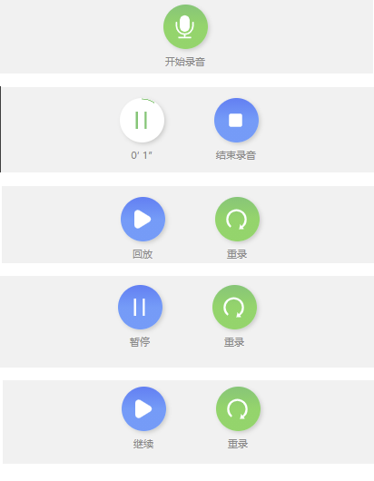
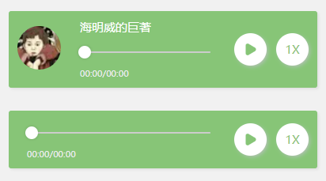

# w-components
微信小程序高质量功能性组件：录音组件、语音播放组件

所提供的的组件不依赖任何第三方组件，下载就能用。

# 组件

| 序号 | 组件名称     | 是否支持 |
| ---- | ------------ | -------- |
| 1    | 录音组件     | √       |
| 2    | 音频播放组件 | √        |
| 3    | 正在添加...  |  |
 

# 安装 & 引用

1、下载代码

	git clone https://github.com/wangzongming/w-components

2、复制到下程序项目中

3、在 app.json 或者页面的 index.json 中引用要用的组件
	
	"usingComponents": {  
		"w-record": "./w-components/record/index",
		"w-audio": "./w-components/w-audio/index"
	},

# 各组件文档

---
---

## 1. 录音组件
录音组件提供：开始录音、结束录音、暂停录音、继续录音、重录、回放、暂停回放、继续回放 功能

并且提供高度样式自定义

### 1.1 预览

"

### 1.2 调用
简单使用的场景下只需要一行代码即可

	<w-record bind:onEnd="recordonEnd" />

### 1.2 配置属性

配置属性都是可选的

	// 使用案例	
	<w-record texts="{{wRecordText}}" />

	// 详细属性

	// 可以替换默认微信录音设置
	recorderManagerOptions: {
		// duration: 600000,
		duration: 1000 * 10,
		sampleRate: 44100,
		numberOfChannels: 1,
		format: 'mp3',
		frameSize: 50,
		encodeBitRate: 64000,
	},

	// 文本
	texts: { 
		start: "开始录音",
		stop: "结束录音",
		continue: "继续录音",
		reset: "重录",
		play: "回放",
		playPause: "暂停",
		playContinue: "继续",
	},

	// 按钮背景颜色
	btnBgs: { 
		start: "linear-gradient(to bottom,#59c574 , #67d467, #67d467)",
		stop: "linear-gradient(to bottom,#4c7ef3 , #589af8, #589af8)",
		pause: "#fff",
		pauseBorder: "#59c574",
		continue: "#fff",
		reset: "linear-gradient(to bottom,#59c574 , #67d467, #67d467)",
		play: "linear-gradient(to bottom,#4c7ef3 , #589af8, #589af8)",
	}, 

### 1.2 回调

recordonEnd 录音结束后的回调， 回调中提供了本地录音文件的地址

onResume    重录回调
 
	<w-record bind:onEnd="recordonEnd" bind:onResume="onResume" />

### 1.3 方法

	// 标签设置 id
	<w-record id="w-record"></w-record>

	// 获取实例并调用方法
	const wRecord = this.selectComponent('#w-record') 

	
	// 开始录音
	wRecord.startRecord();
	// 结束录音
	wRecord.stop();
 	// 播放录音
	wRecord.play();
 	// 重置到 ready(一开始的状态) 状态
	wRecord.toReady();

---
---

## 1. 音频播放组件
音频播放组件提供： 播放音频、暂停、继续 倍速、可拖拽进度条

并且提供高度样式自定义

### 1.1 预览

### 1.2 调用
简单使用的场景下只需要一行代码即可

	<w-audio src="http://music.163.com/song/media/outer/url?id=447925558.mp3" />

### 1.2 配置属性
 
	// 主题色
	mainColor: String,
	// 音频地址
	src: String,
	// 进度条顶部的文字
	desc: String,
	// 音频海报图片地址，存在时左侧会有一个图片
	poster: String,
	// 按钮背景颜色
	btnBgs:  {
		// 暂停按钮
		pause: "#fff",
		// 继续按钮
		continue: "#fff",
		// 播放按钮
		play: "#fff",
	},

### 1.2 方法

	// 标签设置 id
	<w-audio id="w-audio" />

	// 获取实例并调用方法
	const wAudio = this.selectComponent('#w-audio') 

	  
 	// 播放
	wAudio.play(); 
 	// 暂停
	wAudio.pause(); 
	// 继续
	wAudio.resume(); 
 	// 停止
	wAudio.stop(); 

## 微信交流群 

